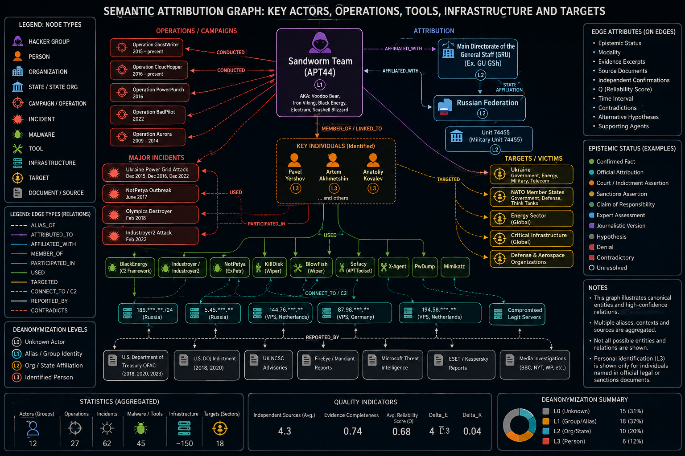
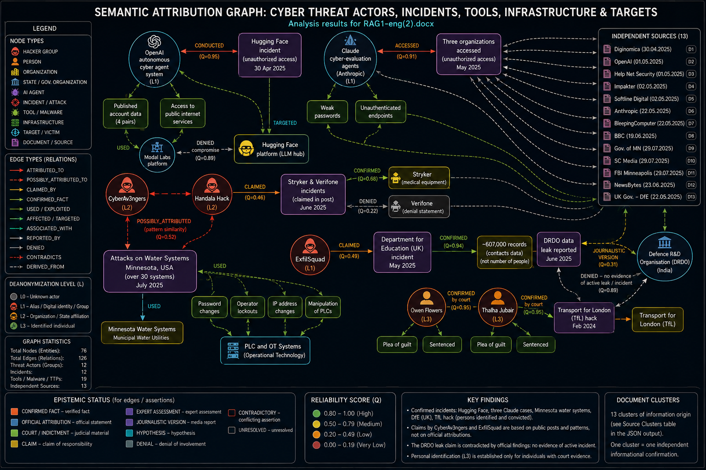
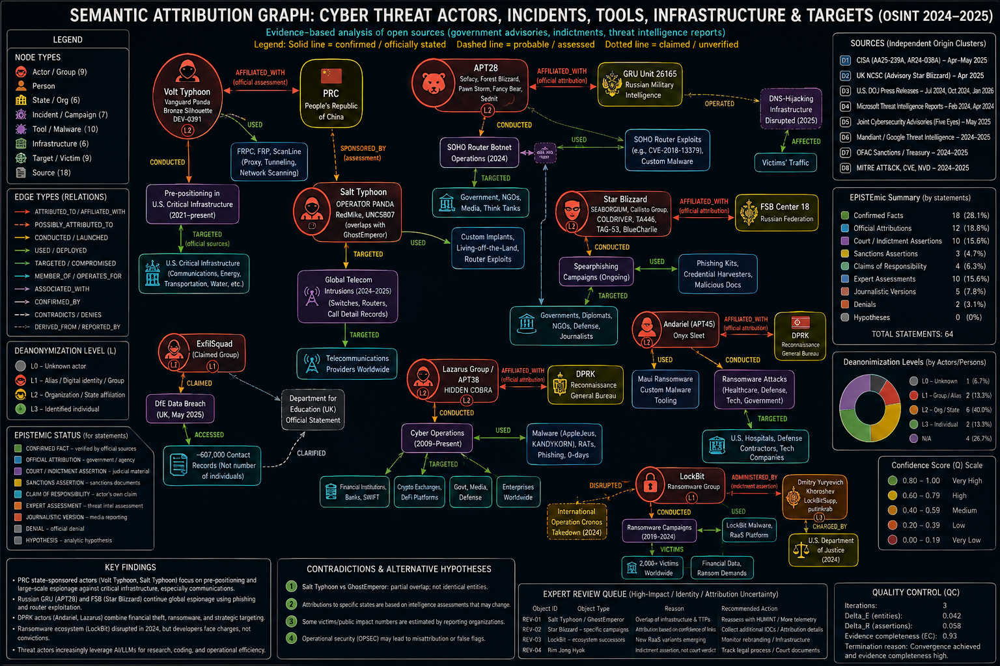

# Experimental Results

This section presents representative examples of the proposed methodology applied to cyber threat intelligence analysis.

The examples illustrate semantic attribution graphs automatically generated from OSINT collections and demonstrate the construction of explainable semantic networks, attribution statements, and controlled de-anonymization.

The experimental RAG examples were obtained from weekly OSINT collections retrieved using the query **"cyber-attack"** from the **InfoStream** content monitoring system (http://infostream.ua).

---

# RAG Examples

### Example 1

*Semantic attribution graph generated from the first weekly RAG collection.*

---

### Example 2

*Semantic attribution graph generated from the second weekly RAG collection.*

---

# BASE Example

The following figure illustrates the methodology applied to a broader manually accumulated OSINT knowledge base without dynamic RAG retrieval.

---

## Notes

The figures are intended solely as representative examples of the proposed methodology.

The complete experimental outputs additionally include:

- canonical entities;
- attribution statements;
- confidence estimates;
- evidence provenance;
- semantic graphs;
- analytical reports;
- structured JSON results.

---

## Complete Analysis Package

The complete representative output of the AgentFlow-based analysis of the `RAG1-eng` dynamic OSINT collection is available as a single downloadable archive:

[Download RAG1 AgentFlow Analysis Package](RAG1-AgentFlow-Analysis-Full.zip)

The archive contains the full analytical report in PDF and Markdown formats, a concise executive report, the structured JSON result, and semantic graph files in GraphML and GEXF formats. It is provided as a reproducible example of the methodology’s output structure, including canonical entities, attribution assertions, source-origin clusters, controlled de-anonymization results, contradictions, expert-review items, and semantic graph relations.
